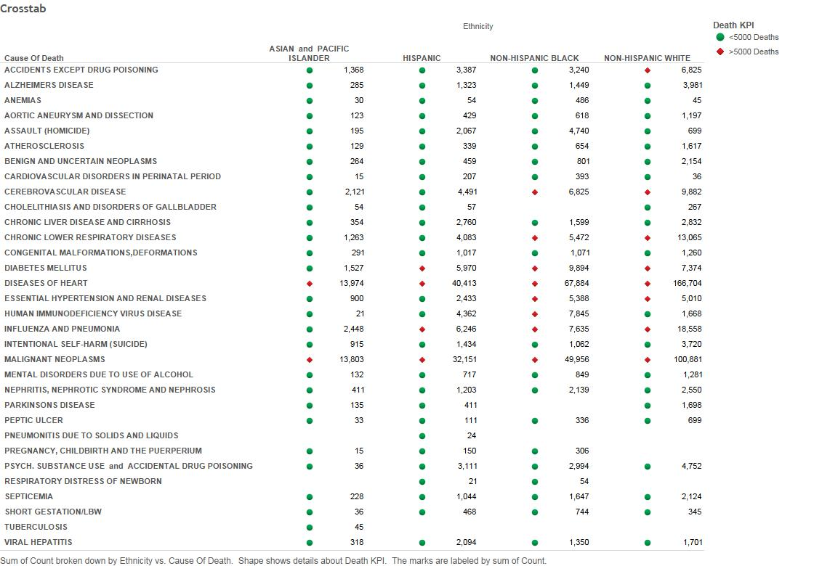
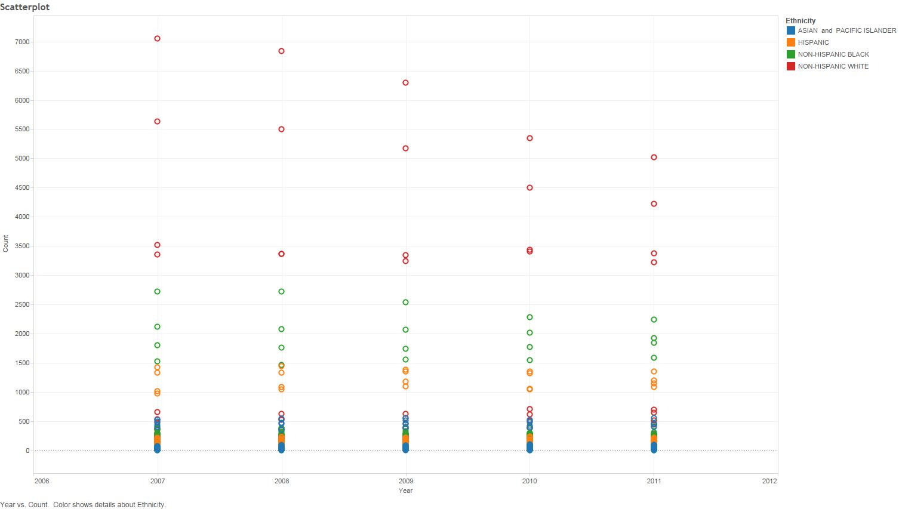
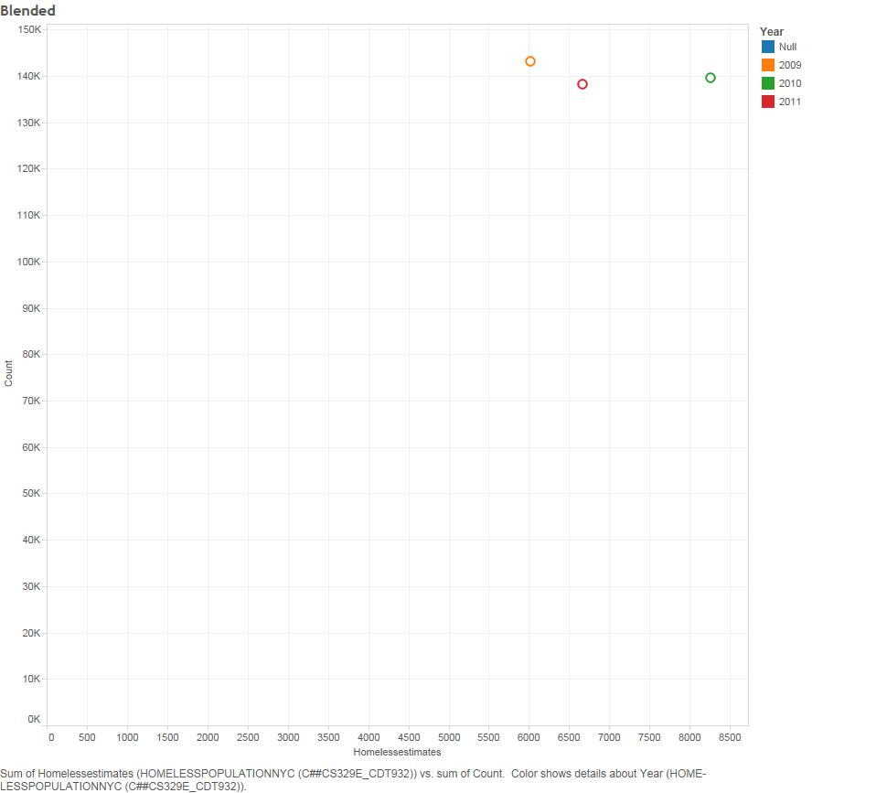

```{r global_options, include=FALSE}
knitr::opts_chunk$set(warning=FALSE)
```

```{r setup, echo=FALSE}

require("ggplot2")

require("ggthemes")

require("gplots")

require("grid")

require("RCurl")

require("reshape2")

require("tableplot")

require("tidyr")

require("dplyr")

require("jsonlite")

require("extrafont")

require("lubridate")

require("knitr")

require("gridExtra")

df <- data.frame(fromJSON(getURL(URLencode('skipper.cs.utexas.edu:5001/rest/native/?query="select * from NYC_DEATHS"'),httpheader=c(DB='jdbc:oracle:thin:@sayonara.microlab.cs.utexas.edu:1521:orcl', USER='C##cs329e_cdt932', PASS='orcl_cdt932', MODE='native_mode', MODEL='model', returnDimensions = 'False', returnFor = 'JSON'), verbose = TRUE), ))
dg <- data.frame(fromJSON(getURL(URLencode('skipper.cs.utexas.edu:5001/rest/native/?query="select * from HOMELESSPOPULATIONNYC"'),httpheader=c(DB='jdbc:oracle:thin:@sayonara.microlab.cs.utexas.edu:1521:orcl', USER='C##cs329e_cdt932', PASS='orcl_cdt932', MODE='native_mode', MODEL='model', returnDimensions = 'False', returnFor = 'JSON'), verbose = TRUE), ))


```

# Tableau Project 2 Documentation

Note that this html file contains the combined "story" for Projects 4  and 5. The Tableau
plots in the "Data" section are from project 4, while all the R plots, as well as the 
"Blended" plots are from Project 5.

## Extract, Transform, and load:

The first step in our project was to load the data onto Oracle in a usable format.
We separated the columns into numerical and non-numerical types, using  3 versions of R\_ETL.R for each csv file. 
Our data was mostly well-behaved, so there wasn't much more to do here
```
file_path <- "./01 Data/New_York_City_Leading_Causes_of_Death.csv"

df <- read.csv(file_path, stringsAsFactors = FALSE)


# Replace "." (i.e., period) with "_" in the column names.
names(df) <- gsub("\\.+", "_", names(df))
names(df)
df <- rename(df, Game = G)


# str(df) # Uncomment this and  run just the lines to here to get column types to use for getting the list of measures.

measures <- c("Year","Count","Percent")


#measures <- NA # Do this if there are no measures.

# Get rid of special characters in each column.
# Google ASCII Table to understand the following:
for(n in names(df)) {
  df[n] <- data.frame(lapply(df[n], gsub, pattern="[^ -~]",replacement= ""))
}

dimensions <- setdiff(names(df), measures)
if( length(measures) > 1 || ! is.na(dimensions)) {
  for(d in dimensions) {
    # Get rid of " and ' in dimensions.
    df[d] <- data.frame(lapply(df[d], gsub, pattern="[\"']",replacement= ""))
    # Change & to and in dimensions.
    df[d] <- data.frame(lapply(df[d], gsub, pattern="&",replacement= " and "))
    # Change : to ; in dimensions.
    df[d] <- data.frame(lapply(df[d], gsub, pattern=":",replacement= ";"))
  }
}

library(lubridate)

# The following is an example of dealing with special cases like making state abbreviations be all upper case.
# df["State"] <- data.frame(lapply(df["State"], toupper))

# Get rid of all characters in measures except for numbers, the - sign, and period.dimensions
if( length(measures) > 1 || ! is.na(measures)) {
  for(m in measures) {
    df[m] <- data.frame(lapply(df[m], gsub, pattern="[^--.0-9]",replacement= ""))
  }
}

write.csv(df, paste(gsub(".csv", "", file_path), ".reformatted.csv", sep=""), row.names=FALSE, na = "")

tableName <- gsub(" +", "_", gsub("[^A-z, 0-9, ]", "", gsub(".csv", "", file_path)))
sql <- paste("CREATE TABLE", tableName, "(\n-- Change table_name to the table name you want.\n")
if( length(measures) > 1 || ! is.na(dimensions)) {
  for(d in dimensions) {
    sql <- paste(sql, paste(d, "varchar2(4000),\n"))
  }
}
if( length(measures) > 1 || ! is.na(measures)) {
  for(m in measures) {
    if(m != tail(measures, n=1)) sql <- paste(sql, paste(m, "number(38,4),\n"))
    else sql <- paste(sql, paste(m, "number(38,4)\n"))
  }
}
sql <- paste(sql, ");")
cat(sql)
```


--------------

## Data 
We created a bar-chart to display some of the more prominent causees of death.


Here's the equivalent chart created using R:
```{r qplot0, fig.width=12,fig.height=8}
source("../03\ R\ SQL Visualizations/barchart.R",echo=TRUE)
```


We also created a crosstab of death-counts, grouping by ethnicity and cause. We also
created a KPI to indicate tabs with deaths over 5000



Here's the equivalent crosstab created using R. The KPI was calculated using an R
function, and the following workflow was used to handle the grouping and summarising:
```
dff <-  group_by(df,CAUSE_OF_DEATH,ETHNICITY) %>% summarise(sumcount=sum(COUNT)) %>% ungroup() %>% rowwise() %>% mutate(Death_KPI=kpi_func(sumcount)) %>% group_by(CAUSE_OF_DEATH,ETHNICITY)
```
```{r qplot1, fig.width=16,fig.height=12}
source("../03\ R\ SQL Visualizations/crosstab.R",echo=TRUE)
```


Then we created a scatterplot of the various causes of death over the years, colored by
ethnicity. This particular visualization would probably be better served by means other
than a scatterplot, but unfortunately our dataset did not lend itself much flexibility
with regards to scatterplots.



Here's the equivalent plot in R:

```{r qplot2, fig.width=16,fig.height=8}
source("../03\ R\ SQL Visualizations/scatterplot.R",echo=TRUE)
```
## Blending

It is through unfortunate luck that we are stuck working with the same dataset 
for two projects in a row. The data was unpleasant to work with for the TProject 1 plots,
but was even worse when it came time to find data to blend with it. Furthermore,
we recently discovered that the reason for some of the oddly large death counts is due
to the fact that the data contains duplicate rows! We hope you can overlook, to some degree,
the odd death tolls due to the bad dataset.

We found a dataset containing homeless
populations for various regions of NYC by year. Unfortunately, due to the fact that
the two datasets share only "year" in common, and that they share only 3 years in
common at that, joining ultimately condenses everything down into a pitiful 3 column x
3 row blended dataset. Ultimately this can only yield one, not particularly enlightening, plot.
In Tableau:

Blending in R was done by grouping each dataset by year, and then summarising the rows by summing over the relevant columns (homeless estimates and death count):
```
dgg <- group_by(dg,YEAR) %>% summarise(EST=sum(HOMELESSESTIMATES))
dfj <- group_by(df,YEAR) %>% summarise(COUNT=sum(COUNT)) %>% inner_join(dgg,by="YEAR")
```
```{r qplot3, fig.width=12,fig.height=8}
source("../03\ R\ SQL Visualizations/blended.R",echo=TRUE)
```

We realize that this is rather lackluster, and hope you are willing to give us some credit
for at least blending the data appropriately. We will make sure to select better data
for the next project

